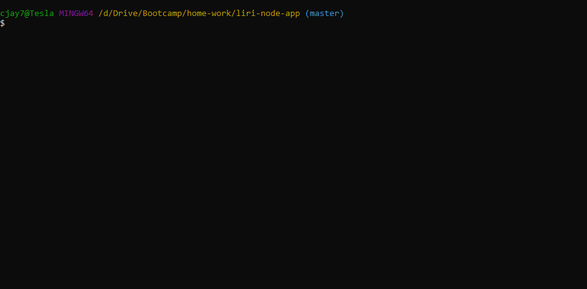
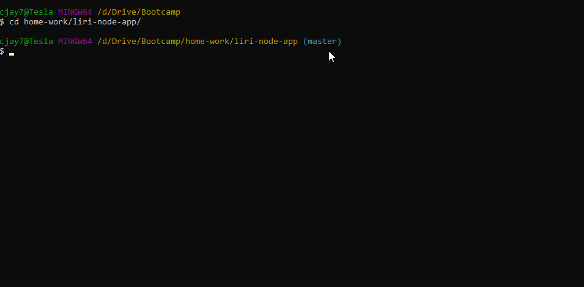
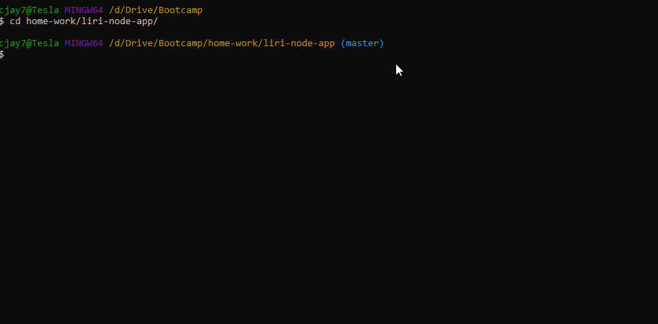
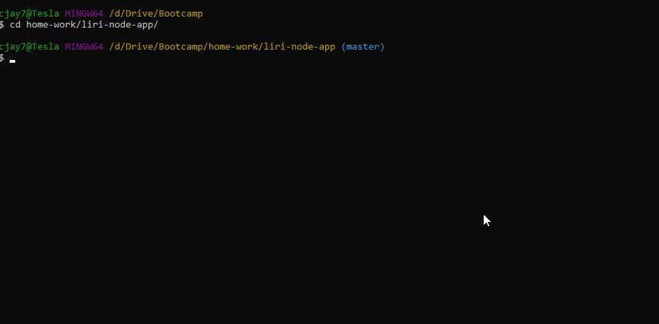
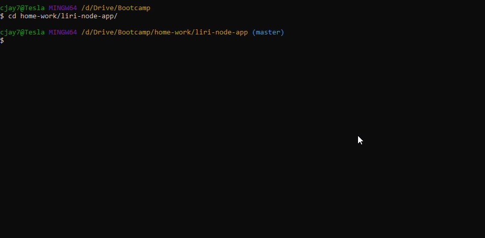

# Liri Bot

### Overview

Liri is a node application meant to simulate search bots such as Siri. It takes text based arguments by the user, and then uses several API's and NPM packages to show results to the user. Because it can't be deployed on Github pages, gifs are used below to demonstrate it's functionality.

## User Experience

While within the directory that the application is contained in, the user must type "node liri.js" and then enter two arguments: search type command, and a search parameter. The 4 search types that can be entered are "concert-this", "movie-this", "spotify-this-song", and "do-what-it-says". If the user's search type argument matches none of these, or they enter no arguments, a message is printed saying the command was invalid.

## Concert This

If the first user input argument is "concert-this", the application displays the venue, location, and date of the search parameter's next three concerts. If the search parameter entered is not a valid musical artist, an error message is printed. If no argument is entered, it defaults the search parameter to "Metallica".

## Movie This

If the first user input argument is "movie-this", the application displays the title, year, rating, countries, languages, plot, and actors from the movie based on the search parameter. If the search parameter entered is not a valid movie, an error message is printed. If no argument is entered, it defaults the search parameter to "Mr. Nobody".

## Spotify This Song

If the first user input argument is "spotify-this-song", the application displays the artists, title, album, and spotify link of the song based on the search parameter. If the search parameter entered is not a valid song, an error message is printed. If no argument is entered, it defaults the search parameter to "The Sign".

## Do What it Says

If the first user input argument is "do-what-it-says", the application choses a random function and search paramater from a local file, and runs it. The respective function works exactly as described above.

